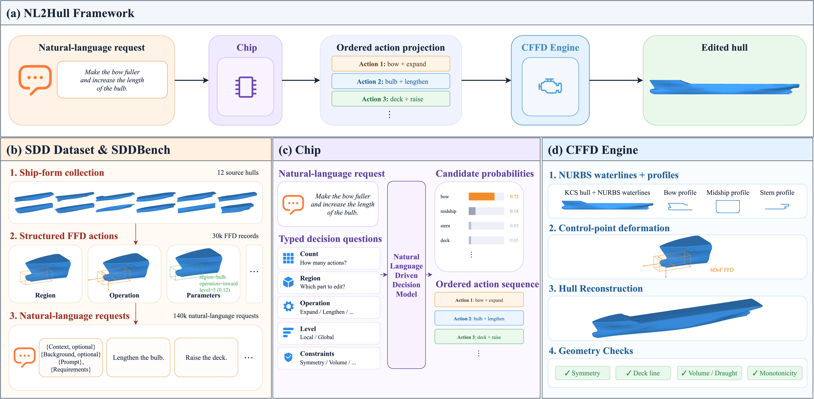
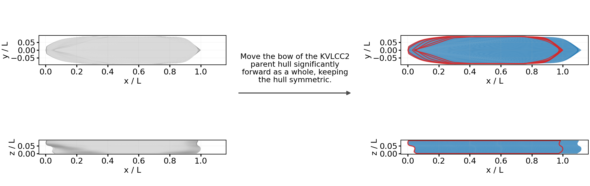
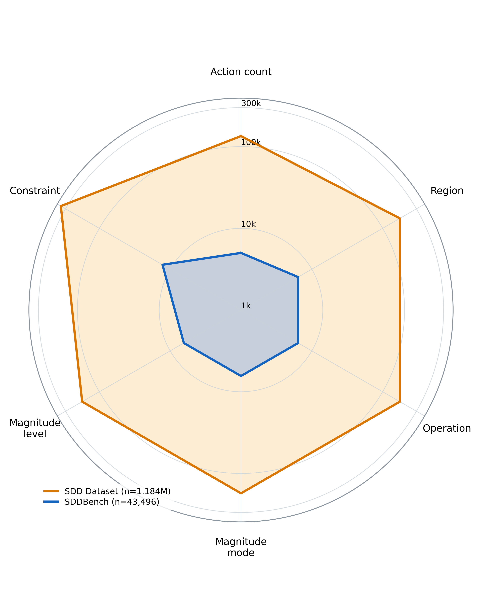

# NL2Hull 中文说明

NL2Hull 面向自然语言驱动的约束船型设计，将船体的 NURBS 表示、自由变形（Free-Form Deformation，FFD）和类型化决策连接起来。



## 项目概览

项目将船舶设计语言离散化，并引入 [Jev-like](https://github.com/jaredpalmer/kev) 决策模型将语义转换为可执行的几何操作，主要包含：

- 船体水线和艏艉纵剖面的归一化 NURBS 表示；
- 面向船体区域、操作类型、变形等级和保持约束的类型化决策；
- FFD 动作投影与连续控制点变形；
- 船体重建、几何合法性检查和约束评估；
- 统一的决策准确率、概率校准、动作精确匹配和端到端执行评测。

英文主说明见 [README.md](README.md)。

[](https://arxiv.org/abs/2610.09896)
[](https://huggingface.co/wenhuahuo/chip-0.8b)
[](https://huggingface.co/datasets/wenhuahuo/ship-design-decisions)

## 方法流程

系统将一条设计请求表示为有序的类型化决策序列。Jev 风格的决策接口选择动作数量及其属性，FFD 引擎随后在归一化 NURBS 船体上执行这些操作。

```text
自然语言请求
      ↓
区域 / 操作 / 幅度 / 约束决策
      ↓
有序 FFD 动作
      ↓
NURBS 控制点变形
      ↓
船体重建与约束检查
```

几何表示采用三次 NURBS 水线、艏艉纵剖面、保持对称性的剖面构造和局部平滑影响窗口。评测过程将调用失败、非法概率、格式错误动作和几何失败纳入相应分母。



## 数据集

项目使用十二种归一化经典船型，并进一步构建了 SDD Dataset (Ship Design Decision Dataset) 和 SDDBench ，包含以下数据目录：

- `datasets/classic_hulls/`：原始与标准化船体几何、元数据和基准清单；
- `datasets/ship_design_structured_actions/`：30,000 条程序生成的结构化 FFD 动作；
- `datasets/ship_design_decisions/`：134,558 条清洗后的语言—决策记录，包含训练集、验证集、测试集和 SDDBench；
- `datasets/jevbench/`：评测协议使用的固定 [JevBench](https://github.com/fstandhartinger/jevbench)；
- `datasets/kev_decision_v7/`：Kev decision-v7 上游数据集，用于原始预训练阶段。

船舶设计决策数据集包含 88,604 条训练记录、22,758条验证记录和23,196条测试记录。数据按船型家族划分：训练集使用 DTC、DTMB 5415、KCS、KVLCC2、集装箱船、护卫舰和 NPL 变体；验证集使用 S-175 与 Series 60；测试集使用 Wigley 与 workboat 船型。



## 快速开始

安装开发版本：

```bash
python -m pip install -e .
```

运行经典船型重建基准：

```bash
python -m nurbs_ship_reconstruction.cli \
  --dataset datasets/classic_hulls \
  --output outputs/local_reconstruction
```

运行 Wigley 船型快速测试：

```bash
python -m nurbs_ship_reconstruction.cli \
  --dataset datasets/classic_hulls \
  --hull wigley_hull \
  --levels 12 \
  --output outputs/wigley_smoke
```

运行测试：

```bash
python -m pytest
```

## 交互式 Demo

本地 Gradio Demo 使用 Chip-0.8B 预测类型化船型设计决策，并将决策应用于内置的 KVLCC2 船型。Demo 提供可拖动的三维模型、侧视图、顶视图以及可选的原始船型叠加对比。

创建并配置 Demo 环境：

```bash
conda create -n nl2hull-demo python=3.12 -y
conda activate nl2hull-demo
python -m pip install -r src/demo/requirements.txt
```

在项目根目录启动 Demo：

```bash
export PYTHONPATH="$PWD/src"
export KEV_DTYPE=fp32
export KEV_BACKEND=torch
export KEV_ATTN=eager
export NL2HULL_DEVICE=cpu
python src/demo/app.py
```

浏览器打开 `http://127.0.0.1:7860`。可以直接输入中文船型设计请求，也可以点击输入框下方的自然语言候选。首次启动会下载公开的 Chip 模型及其 Qwen 基础模型。

## 目录结构

```text
src/nurbs_ship_reconstruction/  NURBS 表示、船体重建和 FFD 引擎
src/dataset/                    结构化数据和语言数据处理
src/benchmarks/                 统一动作与概率评测
src/end2end/                    动作执行与端到端评测
src/model_clients/              决策服务和本地模型适配器
scripts/evaluate/               评测入口
scripts/slurm/                  集群训练与评测任务
tests/                          单元测试和集成测试
visualization/                  论文图片与诊断图生成
datasets/                       本地数据与清单
outputs/                        本地实验输出
```

## 引用

- 论文：[NL2Hull（arXiv）](https://arxiv.org/abs/2610.09896)
- 模型：[wenhuahuo/chip-0.8b](https://huggingface.co/wenhuahuo/chip-0.8b)
- 数据集：[wenhuahuo/ship-design-decisions](https://huggingface.co/datasets/wenhuahuo/ship-design-decisions)

```bibtex
@article{huo2026nl2hull,
  title         = {NL2Hull: A Natural Language-Driven Constrained Ship Design Decision Framework},
  author        = {Huo, Wenhua and Han, Fenglei and Zhao, Wangyuan and Wu, Jialin and Han, Jiayi},
  year          = {2026},
  eprint        = {2610.09896},
  archivePrefix = {arXiv},
  primaryClass  = {cs.AI},
  url           = {https://arxiv.org/abs/2610.09896}
}
```
